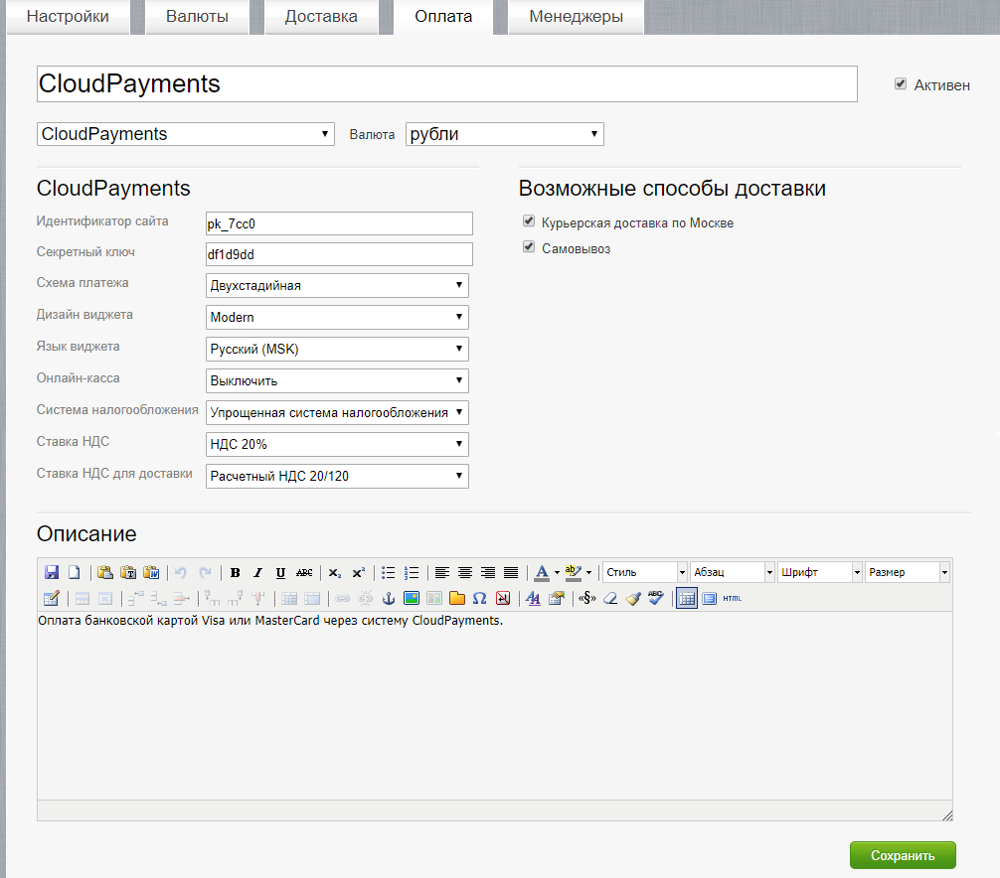

# CloudPayments модуль для Simpla
Модуль позволит с легкостью добавить на ваш сайт оплату банковскими картами через платежный сервис CloudPayments. 
Для корректной работы модуля необходима регистрация в сервисе.

Порядок регистрации описан в [документации CloudPayments](https://cloudpayments.ru/Docs/Connect)

### Совместимость:
* Simpla v.2.3.8 и выше;

### Возможности:  
• Одностадийная схема оплаты;  
• Двухстадийная схема оплаты;  
• Выбор дизайна виджета;  
• Поддержка онлайн-касс (ФЗ-54);  
• Отправка чеков по email;  
• Отправка чеков по SMS;  
• Отдельный параметр НДС для доставки;

### Установка

## Техническая настройка
### Личный кабинет CloudPayments
В личном кабинете CloudPayments в настройках сайта необходимо включить следующие уведомления:

* **Запрос на проверку платежа** (Сheck):\
http://domain.ru/payment/CloudPayments/callback.php?s_action=check
* **Уведомление о принятом платеже** (Pay):\
http://domain.ru/payment/CloudPayments/callback.php?s_action=pay
* **Уведомление о подтверждении платежа** (Confirm):\
http://domain.ru/payment/CloudPayments/callback.php?s_action=confirm
* **Уведомление о возврате платежа** (Refund):\
http://domain.ru/payment/CloudPayments/callback.php?s_action=refund
* **Уведомление об отмене платежа** (Cancel):\
http://domain.ru/payment/CloudPayments/callback.php?s_action=cancel

Где domain.ru — доменное имя вашего сайта. Во всех случаях требуется выбирать вариант по умолчанию: кодировка — UTF-8, HTTP-метод — POST, формат — CloudPayments

### Установка модуля
Для установки модуля необходимо поместить содержимое каталога CloudPayments из архива в каталог payment\CloudPayments на сервере.
  
### Панель администратора Simpla
В настройках платежей (Настройка -> Оплата) необходимо добавить способ оплаты выбрав тип CloudPayments и указать следующие настройки:
* **Идентификатор сайта** — Public id сайта из личного кабинета CloudPayments
* **Секретный ключ** — API Secret из личного кабинета CloudPayments
* **Язык** — Язык виджета. Если не указан, то значение определяется на основе языка сайта

#### При использовании интеграции с онлайн-кассой
* **Онлайн-касса** — Включение/отключение формирования онлайн-чека при оплате
* **Система налогообложения** — Тип системы налогообложения. Возможные значения перечислены в документации CloudPayments https://cloudpayments.ru/Docs/Directory#taxation-system
* **Ставка НДС** — Указание ставки НДС. Все возможные значения указаны в документации https://cloudpayments.ru/Docs/Kassa#data-format
* **Ставка НДС для доставки** — Указание ставки НДС для доставки. Аналогично ставке НДС.

После указания всех данных сохранить настройки.

#### Changelog

= 1.1 =
* добавление двухстадийной схемы оплаты;  
* добавление выбора дизайна виджета;  
* правка значений ставок НДС;

= 1.0 =
* Публикация модуля.